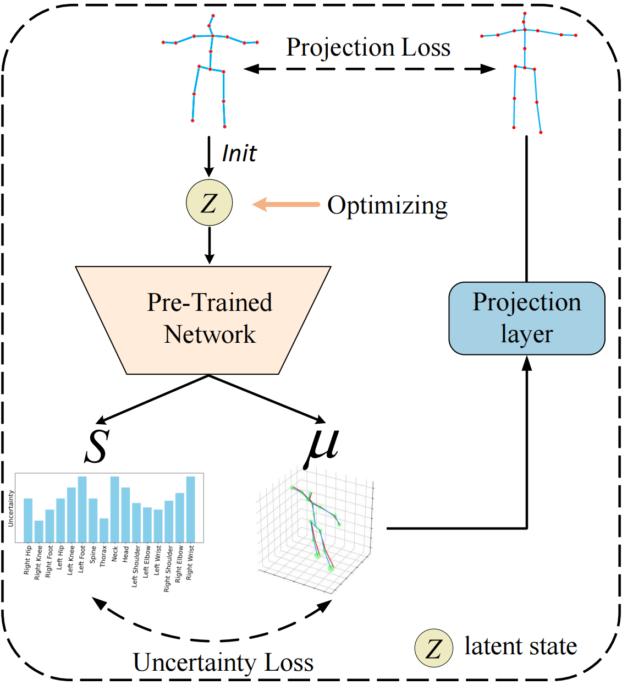

# Uncertainty-Aware Testing-Time Optimization for 3D Human Pose Estimation

This is the official implementation of the approach described in the paper:

> [**Uncertainty-Aware Testing-Time Optimization for 3D Human Pose Estimation**](https://arxiv.org/pdf/2402.02339),            
> Ti Wang, Mengyuan Liu, Hong Liu, Bin Ren, Yingxuan You, Wenhao Li, Nicu Sebe, Xia Li         
> *Accepted by IEEE Transactions on Multimedia (TMM), 2025.*

<p align="center"></p>

## Dataset Setup

### Setup from original source 
You can obtain the Human3.6M dataset from the [Human3.6M](http://vision.imar.ro/human3.6m/) website, and then set it up using the instructions provided in [VideoPose3D](https://github.com/facebookresearch/VideoPose3D). 

### Setup from preprocessed dataset (Recommended)
 You also can access the processed data by downloading it from [here](https://drive.google.com/drive/folders/112GPdRC9IEcwcJRyrLJeYw9_YV4wLdKC?usp=sharing).

```bash
${POSE_ROOT}/
|-- dataset
|   |-- data_3d_h36m.npz
|   |-- data_2d_h36m_gt.npz
|   |-- data_2d_h36m_cpn_ft_h36m_dbb.npz
```

## Installation

### Environment (Original Version)

This work was originally tested on NVIDIA RTX 3090, with:
- Python: 3.7.18
- Pytorch: 1.10.0 
- Cudatoolkit: 10.2

- To create the environment: 
``` bash
conda create -n uao_ori python=3.7 --file ./env/original_conda_env.txt
conda activate uao_ori
```

### Environment (Latest Version)

For newer GPUs (e.g., RTX 4090, which does not support CUDA 10.2), we provide an updated environment. Tested on RTX 4090 with:

- Python: 3.10.18
- Pytorch: 1.13.1 
- Cudatoolkit: 11.7

To create the environment:
```bash
conda env create -f ./env/uao_environment.yml
conda activate uao
```

## Training

The training logs, checkpoints, and related files of each training time will be saved in the './checkpoint' folder.

For training on Human3.6M:

```bash
python main.py --train --gpu 0 --model model_Gaussian --layers 3 --channel 512 --nepoch 40 --batch_size 128
```
Or simply run:
```bash
sh train.sh
```

## Inference

Pre-trained models can be downloaded [here](https://drive.google.com/drive/folders/1B3DsHHeLZWHf8odhBlmiZGi9r1OKhK5n?usp=sharing) and placed in the './pre_trained_models' directory.

To run inference on Human3.6M:

```bash
python main.py --test --batch_size 512 --model model_Gaussian --reload_model --layers 3 --pad 0 --gpu 1 --model_path "path-to-the-pre-trained-model"
```

### Test-Time Optimization (Proposed Strategy)

Our key contribution is an uncertainty-aware test-time optimization strategy, which significantly boosts performance.

This module is **plug-and-play** and can be easily extended to other 2D-to-3D lifting models to further improve their performance.

Run the following command for inference with optimization:
```bash
python main.py --test --test_time_optimization --opt_iter_num 4 --batch_size 512 --model model_Gaussian --reload_model --layers 3 --pad 0 --gpu 1 --model_path "./pre_trained_models/Model_Gaussian_p1_4941.pth"
```

## Performance

We report mean per joint position error (MPJPE, in millimeters) on the Human3.6M dataset. 2D poses are detected by the cascaded pyramid network (CPN) and used as input. GUMLP is our baseline 2D-to-3D lifting model.

|   Models    |  MPJPE   |
| :---------: | :------: |
| GUMLP   |  49.4 mm  |
|  GUMLP + UAO | **46.7** mm (↑ 5.5%) |

## Acknowledgement

Our code is extended from the following repositories. We thank the authors for releasing the codes. 

- [MHFormer](https://github.com/Vegetebird/MHFormer)
- [StridedTransformer-Pose3D](https://github.com/Vegetebird/StridedTransformer-Pose3D)
- [GraphMLP](https://github.com/Vegetebird/GraphMLP)
- [ST-GCN](https://github.com/vanoracai/Exploiting-Spatial-temporal-Relationships-for-3D-Pose-Estimation-via-Graph-Convolutional-Networks)
- [VideoPose3D](https://github.com/facebookresearch/VideoPose3D)


## License

This project is licensed under the terms of the MIT license.


## Citation

If you find our work useful, please consider citing:
```bibtex
@article{wang2024uncertainty,
  title={Uncertainty-Aware Testing-Time Optimization for 3D Human Pose Estimation},
  author={Wang, Ti and Liu, Mengyuan and Liu, Hong and Ren, Bin and You, Yingxuan and Li, Wenhao and Sebe, Nicu and Li, Xia},
  journal={arXiv preprint arXiv:2402.02339},
  year={2024}
}
```